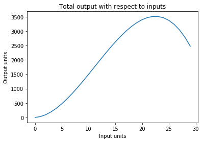
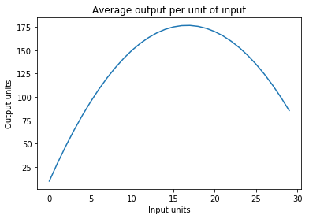

---
redirect_from:
  - "/econ-fa19/wk02/intro-to-production"
interact_link: content/econ-fa19/wk02/Intro_to_Production.ipynb
kernel_name: python3
has_widgets: false
title: 'Intro to Production'
prev_page:
  url: /econ-fa19/wk02/Horizontal_Sum_Supply.html
  title: 'Horizontal Sum Supply'
next_page:
  url: /econ-fa19/wk02/lab02.html
  title: 'Lab 2'
comment: "***PROGRAMMATICALLY GENERATED, DO NOT EDIT. SEE ORIGINAL FILES IN /content***"
---
# Introduction to Production


<div markdown="1" class="cell code_cell">
<div class="input_area" markdown="1">
```python
# HIDDEN
import numpy as np  
import matplotlib.pyplot as plt  
%matplotlib inline
from datascience import *

```
</div>

</div>


## Total Output


Imagine that we have a production function is as follows: 

$$\Large f(x) = -0.6x^3+20x^2+10x$$

Where $x$ is our production input and $f(x)$ is the units of output. For simplicity, we can think of both in dollar terms. 


<div markdown="1" class="cell code_cell">
<div class="input_area" markdown="1">
```python
def graph(formula, x_range, title):  
    x = np.array(x_range)  
    y = formula(x)  # <- note now we're calling the function 'formula' with x
    plt.plot(x, y)
    plt.xlabel("Input units")
    plt.ylabel("Output units")
    plt.title(title)
    plt.show()  

def TPP(x):
    return -0.6*x**3+20*x**2+10*x

graph(TPP, range(0, 30), "Total output with respect to inputs")

```
</div>

<div class="output_wrapper" markdown="1">
<div class="output_subarea" markdown="1">

{:.output_png}


</div>
</div>
</div>


Here is something interesting to note: when we feed in too many inputs, production actually decreases! Typically, this does not happen, but for this example we can imagine that perhaps hiring too many laborers will reduce the overall output of our production.


## Average Output


The average production function is the average number of output for each input unit. The formula is as follows:

$$\begin{aligned} 
\frac{f(x)}{x} &= \frac{-0.6x^3+20x^2+10x}{x} \\
&= -0.6x^2+20x+10 \\
\end{aligned}$$


<div markdown="1" class="cell code_cell">
<div class="input_area" markdown="1">
```python
def APP(x):
    return -0.6*x**2+20*x+10

graph(APP, range(0, 30), "Average output per unit of input")

```
</div>

<div class="output_wrapper" markdown="1">
<div class="output_subarea" markdown="1">

{:.output_png}


</div>
</div>
</div>


## Marginal Output


The marginal production function is the marginal units of output for each additional unit of input. The formula is as follows:

$$\Large \frac{d f(x)}{d x} = -1.8x^2+40x+10$$


<div markdown="1" class="cell code_cell">
<div class="input_area" markdown="1">
```python
def MPP(x):
    return -1.8*x**2+40*x+10

graph(MPP, range(0, 30), "Marginal output per additional unit of input")

```
</div>

<div class="output_wrapper" markdown="1">
<div class="output_subarea" markdown="1">

{:.output_png}


</div>
</div>
</div>


Combining all 3 functions:


<div markdown="1" class="cell code_cell">
<div class="input_area" markdown="1">
```python
# NO CODE
plt.rcParams["font.size"] = 14
fig, axs = plt.subplots(2)
fig.suptitle('Total and Average and Marginal Production')
axs[0].plot(range(0, 30), [TPP(i) for i in range(0, 30)])
axs[0].set_title('TPP')
axs[0].set_ylabel('Unit of Output')
axs[1].plot(range(0, 30), [APP(i) for i in range(0, 30)])
axs[1].plot(range(0, 30), [MPP(i) for i in range(0, 30)])
axs[1].set_title('APP and MPP')
axs[1].set_ylabel('Output per input Y/X')
axs[1].axhline(0)
plt.xlabel("Input units (X)")


fig.set_size_inches(15,15)

```
</div>

<div class="output_wrapper" markdown="1">
<div class="output_subarea" markdown="1">

{:.output_png}


</div>
</div>
</div>


## Think Pair Share
If you were a supplier, how many input units would you use?


## As a Data Set

Let's think about this as a data set. Consider the data set imported below:


<div markdown="1" class="cell code_cell">
<div class="input_area" markdown="1">
```python
TPP = Table().read_table("tableTPP.csv")
TPP.show(20)

```
</div>

<div class="output_wrapper" markdown="1">
<div class="output_subarea" markdown="1">

<div markdown="0" class="output output_html">
<table border="1" class="dataframe">
    <thead>
        <tr>
            <th>Input (x)</th> <th>Output_Y</th> <th>Average_Product</th> <th>Discrete_MP</th> <th>Marginal_Product</th>
        </tr>
    </thead>
    <tbody>
        <tr>
            <td>0        </td> <td>0       </td> <td>nan            </td> <td>nan        </td> <td>10              </td>
        </tr>
        <tr>
            <td>1        </td> <td>29.4    </td> <td>29.4           </td> <td>29.4       </td> <td>48.2            </td>
        </tr>
        <tr>
            <td>2        </td> <td>95.2    </td> <td>47.6           </td> <td>65.8       </td> <td>82.8            </td>
        </tr>
        <tr>
            <td>3        </td> <td>193.8   </td> <td>64.6           </td> <td>98.6       </td> <td>113.8           </td>
        </tr>
        <tr>
            <td>4        </td> <td>321.6   </td> <td>80.4           </td> <td>127.8      </td> <td>141.2           </td>
        </tr>
        <tr>
            <td>5        </td> <td>475     </td> <td>95             </td> <td>153.4      </td> <td>165             </td>
        </tr>
        <tr>
            <td>6        </td> <td>650.4   </td> <td>108.4          </td> <td>175.4      </td> <td>185.2           </td>
        </tr>
        <tr>
            <td>7        </td> <td>844.2   </td> <td>120.6          </td> <td>193.8      </td> <td>201.8           </td>
        </tr>
        <tr>
            <td>8        </td> <td>1052.8  </td> <td>131.6          </td> <td>208.6      </td> <td>214.8           </td>
        </tr>
        <tr>
            <td>9        </td> <td>1272.6  </td> <td>141.4          </td> <td>219.8      </td> <td>224.2           </td>
        </tr>
        <tr>
            <td>10       </td> <td>1500    </td> <td>150            </td> <td>227.4      </td> <td>230             </td>
        </tr>
        <tr>
            <td>11       </td> <td>1731.4  </td> <td>157.4          </td> <td>231.4      </td> <td>232.2           </td>
        </tr>
        <tr>
            <td>12       </td> <td>1963.2  </td> <td>163.6          </td> <td>231.8      </td> <td>230.8           </td>
        </tr>
        <tr>
            <td>13       </td> <td>2191.8  </td> <td>168.6          </td> <td>228.6      </td> <td>225.8           </td>
        </tr>
        <tr>
            <td>14       </td> <td>2413.6  </td> <td>172.4          </td> <td>221.8      </td> <td>217.2           </td>
        </tr>
        <tr>
            <td>15       </td> <td>2625    </td> <td>175            </td> <td>211.4      </td> <td>205             </td>
        </tr>
        <tr>
            <td>16       </td> <td>2822.4  </td> <td>176.4          </td> <td>197.4      </td> <td>189.2           </td>
        </tr>
        <tr>
            <td>17       </td> <td>3002.2  </td> <td>176.6          </td> <td>179.8      </td> <td>169.8           </td>
        </tr>
        <tr>
            <td>18       </td> <td>3160.8  </td> <td>175.6          </td> <td>158.6      </td> <td>146.8           </td>
        </tr>
        <tr>
            <td>19       </td> <td>3294.6  </td> <td>173.4          </td> <td>133.8      </td> <td>120.2           </td>
        </tr>
    </tbody>
</table>
<p>... (1 rows omitted)</p>
</div>

</div>
</div>
</div>


Now, we plot the total, average, and marginal production for this data.


<div markdown="1" class="cell code_cell">
<div class="input_area" markdown="1">
```python
# NO CODE
fig, axs = plt.subplots(2)
fig.suptitle('Total and Average and Marginal Production')
axs[0].plot(TPP.column("Input (x)"),TPP.column("Output_Y"))
axs[0].set_title('TPP')
axs[0].set_ylabel('Unit of Output')

axs[1].plot(TPP.column("Input (x)"),TPP.column("Average_Product"))
axs[1].plot(TPP.column("Input (x)"),TPP.column("Marginal_Product"))
axs[1].set_title('APP and MPP')
axs[1].set_ylabel('Output per input Y/X')
axs[1].axhline(0)
plt.xlabel("Input units (X)")


fig.set_size_inches(15,15)

```
</div>

<div class="output_wrapper" markdown="1">
<div class="output_subarea" markdown="1">

{:.output_png}


</div>
</div>
</div>


_This is the same graph as it comes from the same function!_


 

