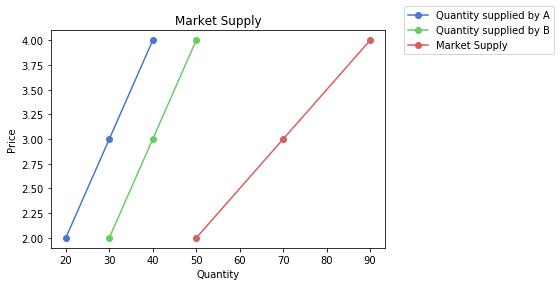

# Lab 2: Supply and Firm Behavior


<div markdown="1" class="cell code_cell">
<div class="input_area" markdown="1">
```python
# HIDDEN
from datascience import *
import matplotlib.pyplot as plt
%matplotlib inline
import numpy as np
import pandas as pd
from utils import *
plt.style.use('seaborn-muted')
from __future__ import print_function
from ipywidgets import interact, interactive, fixed, interact_manual
import ipywidgets as widgets
from matplotlib import patches
import csaps

```
</div>

</div>


Supply of a commodity refers to the quantity of a commodity which producers or sellers are willing produce and offer for sale at a particular price in some given period of time.

Individual supply refers to supply offered by a single firm/producer. Market supply refers to supply offered by all the firms/producers in a market.


## Firms and Supply


To answer questions like at a given price, what will be the supply of a good in the market, we need to know the market supply curve. A supply curve is simply a curve (or graph) which shows the different quantites of a good that can be produced and the prices they will be produced at.

The individual supply curve shows the prices and quantities produced at those prices for a single firm. Market supply curve is the horizontal summation of the individual supply curves in the market.

The following table and graph will give an example of a market with two firm: A and B.


<div markdown="1" class="cell code_cell">
<div class="input_area" markdown="1">
```python
market_supply = Table().with_columns("Price", make_array(2, 3, 4),
                                     "Quantity supplied by A", make_array(20, 30, 40),
                                     "Quantity supplied by B", make_array(30, 40, 50),
                                     "Market Supply", make_array(50, 70, 90))
market_supply

```
</div>

<div class="output_wrapper" markdown="1">
<div class="output_subarea" markdown="1">


<div markdown="0" class="output output_html">
<table border="1" class="dataframe">
    <thead>
        <tr>
            <th>Price</th> <th>Quantity supplied by A</th> <th>Quantity supplied by B</th> <th>Market Supply</th>
        </tr>
    </thead>
    <tbody>
        <tr>
            <td>2    </td> <td>20                    </td> <td>30                    </td> <td>50           </td>
        </tr>
        <tr>
            <td>3    </td> <td>30                    </td> <td>40                    </td> <td>70           </td>
        </tr>
        <tr>
            <td>4    </td> <td>40                    </td> <td>50                    </td> <td>90           </td>
        </tr>
    </tbody>
</table>
</div>


</div>
</div>
</div>


<div markdown="1" class="cell code_cell">
<div class="input_area" markdown="1">
```python
# NO CODE
plt.plot(market_supply.column(1), market_supply.column(0), marker='o')
plt.plot(market_supply.column(2), market_supply.column(0), marker='o')
plt.plot(market_supply.column(3), market_supply.column(0), marker='o')
plt.xlabel('Quantity')
plt.ylabel('Price')
plt.title('Market Supply')
plt.legend(make_array("Quantity supplied by A","Quantity supplied by B","Market Supply"), bbox_to_anchor=(1.04,1), loc="center left")

plt.show()

```
</div>

<div class="output_wrapper" markdown="1">
<div class="output_subarea" markdown="1">

{:.output_png}


</div>
</div>
</div>


Market behaviour relating to supply is based on the behaviour of the individual firms that comprise it. Now, how does an individual firm make its decision about production?

It does so based on the costs associated with production. If the price of a good is enough to recover the costs, the firm produces. Generally, costs increase with the quantity of production. So, to induce producers to increase the quantity supplied, the prices need to increase to compensate for the increased costs.


We will split costs into two categories: Fixed costs and variable costs.


### Fixed Costs

Fixed costs are costs associated with fixed factors (or inputs) of production. For example, land for a factory, capital equipment like machinery, etc. The quantity of these inputs cannot be changed quickly in the short term. A factory owner cannot purchase land quickly enough to ramp up production in a week. A key point to note is that fixed costs are irrespective of the quantity, i.e., they do not change with the quantity produced.


### Variable Costs

Variable Costs are costs associated with variable factors (or inputs) of production. For example, labor, raw materials, etc. The quantity of these inputs can be changed quickly in the short term to adjust supply. A factory owner can hire more laborers or purchase more raw material to increase output. Variable costs change as the supply changes.


### Putting Them Together


The following table will give an example of a firms costs. The columns are:

* **Output:** Units produced and supplied
* **Total Fixed Cost (TFC):** Cost incurred by firm on usage of all fixed factors.
* **Total Variable Cost (TVC):** Cost incurred by firm on usage of all variable factors.
* **Total Cost (TC):** Sum of the total fixed and variable costs
* **Marginal Cost (MC):** Addition to total cost as one more unit of output is produced
* **Average Fixed Cost (AFC):** Cost per unit of fixed factors
* **Average Variable Cost (AVC):** Cost per unit of variable factors
* **Average Total Cost (ATC):** Total cost per unit


<div markdown="1" class="cell code_cell">
<div class="input_area" markdown="1">
```python
individual_firm_costs = Table.read_table('individual_firm_costs.csv')
individual_firm_costs

```
</div>

<div class="output_wrapper" markdown="1">
<div class="output_subarea" markdown="1">


<div markdown="0" class="output output_html">
<table border="1" class="dataframe">
    <thead>
        <tr>
            <th>Output</th> <th>Total Fixed Cost</th> <th>Total Variable Cost</th>
        </tr>
    </thead>
    <tbody>
        <tr>
            <td>0     </td> <td>50              </td> <td>0                  </td>
        </tr>
        <tr>
            <td>1     </td> <td>50              </td> <td>50                 </td>
        </tr>
        <tr>
            <td>2     </td> <td>50              </td> <td>78                 </td>
        </tr>
        <tr>
            <td>3     </td> <td>50              </td> <td>98                 </td>
        </tr>
        <tr>
            <td>4     </td> <td>50              </td> <td>112                </td>
        </tr>
        <tr>
            <td>5     </td> <td>50              </td> <td>130                </td>
        </tr>
        <tr>
            <td>6     </td> <td>50              </td> <td>150                </td>
        </tr>
        <tr>
            <td>7     </td> <td>50              </td> <td>175                </td>
        </tr>
        <tr>
            <td>8     </td> <td>50              </td> <td>204                </td>
        </tr>
        <tr>
            <td>9     </td> <td>50              </td> <td>242                </td>
        </tr>
    </tbody>
</table>
<p>... (2 rows omitted)</p>
</div>


</div>
</div>
</div>


We are going to calculate all of the above mentioned curves using the data above.

First, lets calculate Total cost, which is the sum of total fixed cost and total variable cost.


<div markdown="1" class="cell code_cell">
<div class="input_area" markdown="1">
```python
total_cost = individual_firm_costs.column("Total Fixed Cost") + individual_firm_costs.column("Total Variable Cost")
total_cost

```
</div>

<div class="output_wrapper" markdown="1">
<div class="output_subarea" markdown="1">


{:.output_data_text}
```
array([ 50, 100, 128, 148, 162, 180, 200, 225, 254, 292, 350, 435])
```


</div>
</div>
</div>


<div markdown="1" class="cell code_cell">
<div class="input_area" markdown="1">
```python
# adding the array to the table
individual_firm_costs = individual_firm_costs.with_column("Total Cost", total_cost)
individual_firm_costs

```
</div>

<div class="output_wrapper" markdown="1">
<div class="output_subarea" markdown="1">


<div markdown="0" class="output output_html">
<table border="1" class="dataframe">
    <thead>
        <tr>
            <th>Output</th> <th>Total Fixed Cost</th> <th>Total Variable Cost</th> <th>Total Cost</th>
        </tr>
    </thead>
    <tbody>
        <tr>
            <td>0     </td> <td>50              </td> <td>0                  </td> <td>50        </td>
        </tr>
        <tr>
            <td>1     </td> <td>50              </td> <td>50                 </td> <td>100       </td>
        </tr>
        <tr>
            <td>2     </td> <td>50              </td> <td>78                 </td> <td>128       </td>
        </tr>
        <tr>
            <td>3     </td> <td>50              </td> <td>98                 </td> <td>148       </td>
        </tr>
        <tr>
            <td>4     </td> <td>50              </td> <td>112                </td> <td>162       </td>
        </tr>
        <tr>
            <td>5     </td> <td>50              </td> <td>130                </td> <td>180       </td>
        </tr>
        <tr>
            <td>6     </td> <td>50              </td> <td>150                </td> <td>200       </td>
        </tr>
        <tr>
            <td>7     </td> <td>50              </td> <td>175                </td> <td>225       </td>
        </tr>
        <tr>
            <td>8     </td> <td>50              </td> <td>204                </td> <td>254       </td>
        </tr>
        <tr>
            <td>9     </td> <td>50              </td> <td>242                </td> <td>292       </td>
        </tr>
    </tbody>
</table>
<p>... (2 rows omitted)</p>
</div>


</div>
</div>
</div>


AFC can be calculated as the TFC divided by the output.

First, however, note that at the zero level of output, we would by dividing by zero, which is invalid. So, we will calcuate for all other output levels and add the value for AFC manually at zero. While there should be no value for Average Fixed Cost at output zero, we will put a zero there for coding reasons. We will remove the first row by using `Table.take()` to select only rows in the range of indices from 1 to `num_rows`. Then `np.append(array1, array2)` merges the two arrays, with `array1` being the first array.


<div markdown="1" class="cell code_cell">
<div class="input_area" markdown="1">
```python
individual_firm_costs_no_first = individual_firm_costs.take(np.arange(1, individual_firm_costs.num_rows))
average_fixed_cost = individual_firm_costs_no_first.column("Total Fixed Cost") / individual_firm_costs_no_first.column("Output")
average_fixed_cost = np.append(make_array(0), average_fixed_cost)
average_fixed_cost

```
</div>

<div class="output_wrapper" markdown="1">
<div class="output_subarea" markdown="1">


{:.output_data_text}
```
array([ 0.        , 50.        , 25.        , 16.66666667, 12.5       ,
       10.        ,  8.33333333,  7.14285714,  6.25      ,  5.55555556,
        5.        ,  4.54545455])
```


</div>
</div>
</div>


<div markdown="1" class="cell code_cell">
<div class="input_area" markdown="1">
```python
individual_firm_costs = individual_firm_costs.with_column("Average Fixed Cost", average_fixed_cost)
individual_firm_costs

```
</div>

<div class="output_wrapper" markdown="1">
<div class="output_subarea" markdown="1">


<div markdown="0" class="output output_html">
<table border="1" class="dataframe">
    <thead>
        <tr>
            <th>Output</th> <th>Total Fixed Cost</th> <th>Total Variable Cost</th> <th>Total Cost</th> <th>Average Fixed Cost</th>
        </tr>
    </thead>
    <tbody>
        <tr>
            <td>0     </td> <td>50              </td> <td>0                  </td> <td>50        </td> <td>0                 </td>
        </tr>
        <tr>
            <td>1     </td> <td>50              </td> <td>50                 </td> <td>100       </td> <td>50                </td>
        </tr>
        <tr>
            <td>2     </td> <td>50              </td> <td>78                 </td> <td>128       </td> <td>25                </td>
        </tr>
        <tr>
            <td>3     </td> <td>50              </td> <td>98                 </td> <td>148       </td> <td>16.6667           </td>
        </tr>
        <tr>
            <td>4     </td> <td>50              </td> <td>112                </td> <td>162       </td> <td>12.5              </td>
        </tr>
        <tr>
            <td>5     </td> <td>50              </td> <td>130                </td> <td>180       </td> <td>10                </td>
        </tr>
        <tr>
            <td>6     </td> <td>50              </td> <td>150                </td> <td>200       </td> <td>8.33333           </td>
        </tr>
        <tr>
            <td>7     </td> <td>50              </td> <td>175                </td> <td>225       </td> <td>7.14286           </td>
        </tr>
        <tr>
            <td>8     </td> <td>50              </td> <td>204                </td> <td>254       </td> <td>6.25              </td>
        </tr>
        <tr>
            <td>9     </td> <td>50              </td> <td>242                </td> <td>292       </td> <td>5.55556           </td>
        </tr>
    </tbody>
</table>
<p>... (2 rows omitted)</p>
</div>


</div>
</div>
</div>


Similarly, AVC can be calculated as the TVC divided by the output.


<div markdown="1" class="cell code_cell">
<div class="input_area" markdown="1">
```python
average_variable_cost = individual_firm_costs_no_first.column("Total Variable Cost")/individual_firm_costs_no_first.column("Output")
average_variable_cost = np.append(make_array(0), average_variable_cost)
average_variable_cost

```
</div>

<div class="output_wrapper" markdown="1">
<div class="output_subarea" markdown="1">


{:.output_data_text}
```
array([ 0.        , 50.        , 39.        , 32.66666667, 28.        ,
       26.        , 25.        , 25.        , 25.5       , 26.88888889,
       30.        , 35.        ])
```


</div>
</div>
</div>


<div markdown="1" class="cell code_cell">
<div class="input_area" markdown="1">
```python
individual_firm_costs = individual_firm_costs.with_column("Average Variable Cost", average_variable_cost)
individual_firm_costs

```
</div>

<div class="output_wrapper" markdown="1">
<div class="output_subarea" markdown="1">


<div markdown="0" class="output output_html">
<table border="1" class="dataframe">
    <thead>
        <tr>
            <th>Output</th> <th>Total Fixed Cost</th> <th>Total Variable Cost</th> <th>Total Cost</th> <th>Average Fixed Cost</th> <th>Average Variable Cost</th>
        </tr>
    </thead>
    <tbody>
        <tr>
            <td>0     </td> <td>50              </td> <td>0                  </td> <td>50        </td> <td>0                 </td> <td>0                    </td>
        </tr>
        <tr>
            <td>1     </td> <td>50              </td> <td>50                 </td> <td>100       </td> <td>50                </td> <td>50                   </td>
        </tr>
        <tr>
            <td>2     </td> <td>50              </td> <td>78                 </td> <td>128       </td> <td>25                </td> <td>39                   </td>
        </tr>
        <tr>
            <td>3     </td> <td>50              </td> <td>98                 </td> <td>148       </td> <td>16.6667           </td> <td>32.6667              </td>
        </tr>
        <tr>
            <td>4     </td> <td>50              </td> <td>112                </td> <td>162       </td> <td>12.5              </td> <td>28                   </td>
        </tr>
        <tr>
            <td>5     </td> <td>50              </td> <td>130                </td> <td>180       </td> <td>10                </td> <td>26                   </td>
        </tr>
        <tr>
            <td>6     </td> <td>50              </td> <td>150                </td> <td>200       </td> <td>8.33333           </td> <td>25                   </td>
        </tr>
        <tr>
            <td>7     </td> <td>50              </td> <td>175                </td> <td>225       </td> <td>7.14286           </td> <td>25                   </td>
        </tr>
        <tr>
            <td>8     </td> <td>50              </td> <td>204                </td> <td>254       </td> <td>6.25              </td> <td>25.5                 </td>
        </tr>
        <tr>
            <td>9     </td> <td>50              </td> <td>242                </td> <td>292       </td> <td>5.55556           </td> <td>26.8889              </td>
        </tr>
    </tbody>
</table>
<p>... (2 rows omitted)</p>
</div>


</div>
</div>
</div>


Similarly, ATC can be calculated as the TC divided by the output.


<div markdown="1" class="cell code_cell">
<div class="input_area" markdown="1">
```python
average_total_cost = individual_firm_costs_no_first.column("Total Cost")/individual_firm_costs_no_first.column("Output")
average_total_cost = np.append(make_array(0), average_total_cost)
average_total_cost

```
</div>

<div class="output_wrapper" markdown="1">
<div class="output_subarea" markdown="1">


{:.output_data_text}
```
array([  0.        , 100.        ,  64.        ,  49.33333333,
        40.5       ,  36.        ,  33.33333333,  32.14285714,
        31.75      ,  32.44444444,  35.        ,  39.54545455])
```


</div>
</div>
</div>


<div markdown="1" class="cell code_cell">
<div class="input_area" markdown="1">
```python
individual_firm_costs = individual_firm_costs.with_column("Average Total Cost", average_total_cost)
individual_firm_costs

```
</div>

<div class="output_wrapper" markdown="1">
<div class="output_subarea" markdown="1">


<div markdown="0" class="output output_html">
<table border="1" class="dataframe">
    <thead>
        <tr>
            <th>Output</th> <th>Total Fixed Cost</th> <th>Total Variable Cost</th> <th>Total Cost</th> <th>Average Fixed Cost</th> <th>Average Variable Cost</th> <th>Average Total Cost</th>
        </tr>
    </thead>
    <tbody>
        <tr>
            <td>0     </td> <td>50              </td> <td>0                  </td> <td>50        </td> <td>0                 </td> <td>0                    </td> <td>0                 </td>
        </tr>
        <tr>
            <td>1     </td> <td>50              </td> <td>50                 </td> <td>100       </td> <td>50                </td> <td>50                   </td> <td>100               </td>
        </tr>
        <tr>
            <td>2     </td> <td>50              </td> <td>78                 </td> <td>128       </td> <td>25                </td> <td>39                   </td> <td>64                </td>
        </tr>
        <tr>
            <td>3     </td> <td>50              </td> <td>98                 </td> <td>148       </td> <td>16.6667           </td> <td>32.6667              </td> <td>49.3333           </td>
        </tr>
        <tr>
            <td>4     </td> <td>50              </td> <td>112                </td> <td>162       </td> <td>12.5              </td> <td>28                   </td> <td>40.5              </td>
        </tr>
        <tr>
            <td>5     </td> <td>50              </td> <td>130                </td> <td>180       </td> <td>10                </td> <td>26                   </td> <td>36                </td>
        </tr>
        <tr>
            <td>6     </td> <td>50              </td> <td>150                </td> <td>200       </td> <td>8.33333           </td> <td>25                   </td> <td>33.3333           </td>
        </tr>
        <tr>
            <td>7     </td> <td>50              </td> <td>175                </td> <td>225       </td> <td>7.14286           </td> <td>25                   </td> <td>32.1429           </td>
        </tr>
        <tr>
            <td>8     </td> <td>50              </td> <td>204                </td> <td>254       </td> <td>6.25              </td> <td>25.5                 </td> <td>31.75             </td>
        </tr>
        <tr>
            <td>9     </td> <td>50              </td> <td>242                </td> <td>292       </td> <td>5.55556           </td> <td>26.8889              </td> <td>32.4444           </td>
        </tr>
    </tbody>
</table>
<p>... (2 rows omitted)</p>
</div>


</div>
</div>
</div>


MC can be calculated as the difference between TC at current output level and TC at previous output level (or TVC, as TFC is fixed). For this we are going to use the function `np.diff`. You can read about it in the [Python reference](http://d8a-88.github.io/econ-fa19/python-reference.html).


<div markdown="1" class="cell code_cell">
<div class="input_area" markdown="1">
```python
marginal_cost = np.diff(total_cost)
marginal_cost = np.append(make_array(0), marginal_cost)
marginal_cost

```
</div>

<div class="output_wrapper" markdown="1">
<div class="output_subarea" markdown="1">


{:.output_data_text}
```
array([ 0, 50, 28, 20, 14, 18, 20, 25, 29, 38, 58, 85])
```


</div>
</div>
</div>


<div markdown="1" class="cell code_cell">
<div class="input_area" markdown="1">
```python
individual_firm_costs = individual_firm_costs.with_column("Marginal Cost", marginal_cost)
individual_firm_costs

```
</div>

<div class="output_wrapper" markdown="1">
<div class="output_subarea" markdown="1">


<div markdown="0" class="output output_html">
<table border="1" class="dataframe">
    <thead>
        <tr>
            <th>Output</th> <th>Total Fixed Cost</th> <th>Total Variable Cost</th> <th>Total Cost</th> <th>Average Fixed Cost</th> <th>Average Variable Cost</th> <th>Average Total Cost</th> <th>Marginal Cost</th>
        </tr>
    </thead>
    <tbody>
        <tr>
            <td>0     </td> <td>50              </td> <td>0                  </td> <td>50        </td> <td>0                 </td> <td>0                    </td> <td>0                 </td> <td>0            </td>
        </tr>
        <tr>
            <td>1     </td> <td>50              </td> <td>50                 </td> <td>100       </td> <td>50                </td> <td>50                   </td> <td>100               </td> <td>50           </td>
        </tr>
        <tr>
            <td>2     </td> <td>50              </td> <td>78                 </td> <td>128       </td> <td>25                </td> <td>39                   </td> <td>64                </td> <td>28           </td>
        </tr>
        <tr>
            <td>3     </td> <td>50              </td> <td>98                 </td> <td>148       </td> <td>16.6667           </td> <td>32.6667              </td> <td>49.3333           </td> <td>20           </td>
        </tr>
        <tr>
            <td>4     </td> <td>50              </td> <td>112                </td> <td>162       </td> <td>12.5              </td> <td>28                   </td> <td>40.5              </td> <td>14           </td>
        </tr>
        <tr>
            <td>5     </td> <td>50              </td> <td>130                </td> <td>180       </td> <td>10                </td> <td>26                   </td> <td>36                </td> <td>18           </td>
        </tr>
        <tr>
            <td>6     </td> <td>50              </td> <td>150                </td> <td>200       </td> <td>8.33333           </td> <td>25                   </td> <td>33.3333           </td> <td>20           </td>
        </tr>
        <tr>
            <td>7     </td> <td>50              </td> <td>175                </td> <td>225       </td> <td>7.14286           </td> <td>25                   </td> <td>32.1429           </td> <td>25           </td>
        </tr>
        <tr>
            <td>8     </td> <td>50              </td> <td>204                </td> <td>254       </td> <td>6.25              </td> <td>25.5                 </td> <td>31.75             </td> <td>29           </td>
        </tr>
        <tr>
            <td>9     </td> <td>50              </td> <td>242                </td> <td>292       </td> <td>5.55556           </td> <td>26.8889              </td> <td>32.4444           </td> <td>38           </td>
        </tr>
    </tbody>
</table>
<p>... (2 rows omitted)</p>
</div>


</div>
</div>
</div>


Let's look at some plots! First, we'll plot the total fixed cost, total variable cost, and total cost:


<div markdown="1" class="cell code_cell">
<div class="input_area" markdown="1">
```python
# NO CODE
plt.plot(individual_firm_costs.column("Output"), individual_firm_costs.column("Total Fixed Cost"), marker='o')
plt.plot(individual_firm_costs.column("Output"), individual_firm_costs.column("Total Variable Cost"), marker='o')
plt.plot(individual_firm_costs.column("Output"), individual_firm_costs.column("Total Cost"), marker='o')
plt.xlabel('Quantity')
plt.ylabel('Cost')
plt.title('TFC, TVC and TC')
plt.legend(make_array("Total Fixed Cost","Total Variable Cost","Total Cost"))

plt.show()

```
</div>

<div class="output_wrapper" markdown="1">
<div class="output_subarea" markdown="1">

{:.output_png}


</div>
</div>
</div>


Now let's look at the AFC, AVC, and ATC:


<div markdown="1" class="cell code_cell">
<div class="input_area" markdown="1">
```python
# NO CODE
plt.plot(individual_firm_costs.column("Output")[1:], individual_firm_costs.column("Average Fixed Cost")[1:], marker='o')
plt.plot(individual_firm_costs.column("Output")[1:], individual_firm_costs.column("Average Variable Cost")[1:], marker='o')
plt.plot(individual_firm_costs.column("Output")[1:], individual_firm_costs.column("Average Total Cost")[1:], marker='o')
plt.xlabel('Quantity')
plt.ylabel('Cost')
plt.title('AFC, AVC and ATC')
plt.legend(make_array("Average Fixed Cost","Average Variable Cost","Average Total Cost"))

plt.show()

```
</div>

<div class="output_wrapper" markdown="1">
<div class="output_subarea" markdown="1">

{:.output_png}


</div>
</div>
</div>


Notice that as we increase the quantity, the AFC goes down and the AVC converges to the ATC. Will the AVC ever cross the ATC?

The answer is no because regardless of how many units we're producing, the AFC is _always_ greater than 0, so the ATC has to be greater than the AVC.


Now let's look at a more interesting plot: the marginal cost, AVC, and ATC.


<div markdown="1" class="cell code_cell">
<div class="input_area" markdown="1">
```python
# NO CODE
plt.plot(individual_firm_costs.column("Output")[1:], individual_firm_costs.column("Marginal Cost")[1:], marker='o')
plt.plot(individual_firm_costs.column("Output")[1:], individual_firm_costs.column("Average Variable Cost")[1:], marker='o')
plt.plot(individual_firm_costs.column("Output")[1:], individual_firm_costs.column("Average Total Cost")[1:], marker='o')
plt.xlabel('Quantity')
plt.ylabel('Cost')
plt.title('Mc, AVC and ATC')
plt.legend(make_array("Marginal Cost","Average Variable Cost","Average Total Cost"))

plt.show()

```
</div>

<div class="output_wrapper" markdown="1">
<div class="output_subarea" markdown="1">

{:.output_png}


</div>
</div>
</div>


What do you notice about the way that the MC curve intersects with the AVC and ATC curves? It always intersects their their minima! This is because once the additional cost per good (MC) becomes greater than the average cost, the average begins going up.

To illustrate this point, the plot below shows the tangent line at each intersection point. Notice that the slope of the tangent is 0, meaning that we're at the exact minimum of the function.


<div markdown="1" class="cell code_cell">
<div class="input_area" markdown="1">
```python
# NO CODE
output = individual_firm_costs.column("Output")[1:]
mc = individual_firm_costs.column("Marginal Cost")[1:]
avc = individual_firm_costs.column("Average Variable Cost")[1:]
atc = individual_firm_costs.column("Average Total Cost")[1:]

sp_mc = csaps.UnivariateCubicSmoothingSpline(output, mc, smooth=0.85)
sp_avc = csaps.UnivariateCubicSmoothingSpline(output, avc, smooth=0.85)
sp_atc = csaps.UnivariateCubicSmoothingSpline(output, atc, smooth=0.85)

output_s = np.linspace(output.min(), output.max(), 150)
mc_s = sp_mc(output_s)
avc_s = sp_avc(output_s)
atc_s = sp_atc(output_s)

plt.plot(output, mc, marker = 'o', color = 'tab:blue')
plt.plot(output_s, mc_s, alpha=0.7, lw = 2, label='_nolegend_', color = 'tab:blue')
plt.plot(output, avc, marker = 'o', color = 'tab:green')
plt.plot(output_s, avc_s, alpha=0.7, lw = 2, label='_nolegend_', color = 'tab:green')
plt.plot(output, atc, marker = 'o', color = 'tab:orange')
plt.plot(output_s, atc_s, alpha=0.7, lw = 2, label='_nolegend_', color = 'tab:orange')
plt.hlines(y=min(avc), xmin = 6, xmax = 8, lw=3, color='r', zorder = 10)
plt.hlines(y=min(atc), xmin = 7.5, xmax = 9.5, lw=3, color='r', zorder = 10)
plt.xlabel('Quantity')
plt.ylabel('Cost')
plt.title('MC, AVC and ATC')
plt.legend(make_array("Marginal Cost","Average Variable Cost","Average Total Cost"))

plt.show()

```
</div>

<div class="output_wrapper" markdown="1">
<div class="output_subarea" markdown="1">

{:.output_png}


</div>
</div>
</div>


What do you notice? **A company decides to produce if it the price is greater than or equal to its Average Variable Cost.**


There are 3 different scenarios: they do not produce at all, they produce at a loss (minimising quantity), and they produce at a profit. Play around with the slider to see them.


<div markdown="1" class="cell code_cell">
<div class="input_area" markdown="1">
```python
interact(lambda price: firm_behaviour(price, individual_firm_costs), price=widgets.IntSlider(min=20,max=60,step=1,value=25));

```
</div>

<div class="output_wrapper" markdown="1">
<div class="output_subarea" markdown="1">
{:.output_data_text}
```
interactive(children=(IntSlider(value=25, description='price', max=60, min=20), Output()), _dom_classes=('widg…
```

</div>
</div>
</div>

<div id="lab02-wgt01">
    <iframe src="http://econ-models-widget.herokuapp.com/#lab02-wgt01" id="lab02-wgt01-iframe" width="100%" height="400px"></iframe>
    <script type="text/javascript">
        var widget = document.querySelector("#lab02-wgt01-iframe");
        widget.contentWindow;
    </script>
</div>

In the above example, if the price is 24, for any amount of production, the firm will lose money. In this case, they shut down and the loss is limited to its fixed costs.

If the price is above the minimum of AVC (25 in the example), for some amount of production, the firm will maximise its profits (or minimise its losses). Profits are Total Revenue minus Total Costs, where Total Revenue is Price times Quantity.


Therefore, based on the price, each firm looks at its costs and makes a decision to produce. At low prices, only the firms with the lowest production costs produce. As the price increases, firms with higher production costs find it feasible to produce and begin to supply. Thus, the market supply rises with higher prices. Firms with lower costs make extra profits. 


## An Example from EEP 147


Let's look at a real life example! This comes from **EEP 147 Regulation of Energy and the Environment**. The table below, stored as `ESG_table`, holds data on power plants grouped by means of production and contains data on their capacities (in MW) and their AVCs.


<div markdown="1" class="cell code_cell">
<div class="input_area" markdown="1">
```python
# NO CODE
ESG_table = Table.read_table('ESGPorfolios_forcsv.csv').select(
    "Group", "Group_num", "UNIT NAME", "Capacity_MW", "Total_Var_Cost_USDperMWH").sort(
    "Total_Var_Cost_USDperMWH", descending = False).relabel(4, "Average Variable Cost")
ESG_table

```
</div>

<div class="output_wrapper" markdown="1">
<div class="output_subarea" markdown="1">


<div markdown="0" class="output output_html">
<table border="1" class="dataframe">
    <thead>
        <tr>
            <th>Group</th> <th>Group_num</th> <th>UNIT NAME</th> <th>Capacity_MW</th> <th>Average Variable Cost</th>
        </tr>
    </thead>
    <tbody>
        <tr>
            <td>Old Timers  </td> <td>7        </td> <td>BIG CREEK      </td> <td>1000       </td> <td>0                    </td>
        </tr>
        <tr>
            <td>Fossil Light</td> <td>8        </td> <td>HELMS          </td> <td>800        </td> <td>0.5                  </td>
        </tr>
        <tr>
            <td>Fossil Light</td> <td>8        </td> <td>DIABLO CANYON 1</td> <td>1000       </td> <td>11.5                 </td>
        </tr>
        <tr>
            <td>Bay Views   </td> <td>4        </td> <td>MOSS LANDING 6 </td> <td>750        </td> <td>32.56                </td>
        </tr>
        <tr>
            <td>Bay Views   </td> <td>4        </td> <td>MOSS LANDING 7 </td> <td>750        </td> <td>32.56                </td>
        </tr>
        <tr>
            <td>Old Timers  </td> <td>7        </td> <td>MOHAVE 1       </td> <td>750        </td> <td>34.5                 </td>
        </tr>
        <tr>
            <td>Old Timers  </td> <td>7        </td> <td>MOHAVE 2       </td> <td>750        </td> <td>34.5                 </td>
        </tr>
        <tr>
            <td>Big Coal    </td> <td>1        </td> <td>FOUR CORNERS   </td> <td>1900       </td> <td>36.5                 </td>
        </tr>
        <tr>
            <td>Bay Views   </td> <td>4        </td> <td>MORRO BAY 3&4  </td> <td>665        </td> <td>36.61                </td>
        </tr>
        <tr>
            <td>East Bay    </td> <td>6        </td> <td>PITTSBURGH 5&6 </td> <td>650        </td> <td>36.61                </td>
        </tr>
    </tbody>
</table>
<p>... (32 rows omitted)</p>
</div>


</div>
</div>
</div>


This table shows some electricity producers and their costs. You can think about the Capacity as the output the firm is capable of producing. The Average Variable Cost shows the minimum variable cost per MW produced. At a price below AVC, the firm supplies nothing. At a price above the AVC, the firm can supply upto its capacity. Being a profit maximising firm, it will try to supply its full capacity.


First, lets look at just the Big Coal producers and understand the data.


<div markdown="1" class="cell code_cell">
<div class="input_area" markdown="1">
```python
selection = 'Big Coal'
Group = ESG_table.where("Group", selection)
Group

```
</div>

<div class="output_wrapper" markdown="1">
<div class="output_subarea" markdown="1">


<div markdown="0" class="output output_html">
<table border="1" class="dataframe">
    <thead>
        <tr>
            <th>Group</th> <th>Group_num</th> <th>UNIT NAME</th> <th>Capacity_MW</th> <th>Average Variable Cost</th>
        </tr>
    </thead>
    <tbody>
        <tr>
            <td>Big Coal</td> <td>1        </td> <td>FOUR CORNERS        </td> <td>1900       </td> <td>36.5                 </td>
        </tr>
        <tr>
            <td>Big Coal</td> <td>1        </td> <td>HUNTINGTON BEACH 1&2</td> <td>300        </td> <td>40.5                 </td>
        </tr>
        <tr>
            <td>Big Coal</td> <td>1        </td> <td>REDONDO 5&6         </td> <td>350        </td> <td>41.94                </td>
        </tr>
        <tr>
            <td>Big Coal</td> <td>1        </td> <td>REDONDO 7&8         </td> <td>950        </td> <td>41.94                </td>
        </tr>
        <tr>
            <td>Big Coal</td> <td>1        </td> <td>HUNTINGTON BEACH 5  </td> <td>150        </td> <td>66.5                 </td>
        </tr>
        <tr>
            <td>Big Coal</td> <td>1        </td> <td>ALAMITOS 7          </td> <td>250        </td> <td>73.72                </td>
        </tr>
    </tbody>
</table>
</div>


</div>
</div>
</div>


<div markdown="1" class="cell code_cell">
<div class="input_area" markdown="1">
```python
# NO CODE
# Make the plot
plt.figure(figsize=(9,6))
plt.bar(new_x_group, height_group, width=width_group, edgecolor = "black")
# Add title and axis names
plt.title(selection)
plt.xlabel('Capacity_MW')
plt.ylabel('Variable Cost/Price')

plt.show()

```
</div>

<div class="output_wrapper" markdown="1">
<div class="output_subarea" markdown="1">

{:.output_png}


</div>
</div>
</div>


This figure is the Big Coal Supply curve. It shows the price of electricity, and the quantity supplied at those prices (which depends on Variable Cost). For example, at any Variable Cost at or above 36.5, the producer FOUR CORNERS	(the one with the lowest production costs) will supply, and so on.

Lets interact with it.


<div markdown="1" class="cell code_cell">
<div class="input_area" markdown="1">
```python
interact(group_plot, price=widgets.IntSlider(min=20,max=80,step=1,value=37));

```
</div>

<div class="output_wrapper" markdown="1">
<div class="output_subarea" markdown="1">
{:.output_data_text}
```
interactive(children=(IntSlider(value=37, description='price', max=80, min=20), Output()), _dom_classes=('widg…
```

</div>
</div>
</div>


We are going to repeat the same process, this time for all the energy sources. They have been colored according to source for reference.


<div markdown="1" class="cell code_cell">
<div class="input_area" markdown="1">
```python
interact(ESG_plot, price=widgets.IntSlider(min=0,max=90,step=1,value=37));

```
</div>

<div class="output_wrapper" markdown="1">
<div class="output_subarea" markdown="1">
{:.output_data_text}
```
interactive(children=(IntSlider(value=37, description='price', max=90), Output()), _dom_classes=('widget-inter…
```

</div>
</div>
</div>


 

