# Lab 3: Demand Curve and Inverse Demand Curve


Last week, we learned about the supply curve. This week, we will learn about the demand curve and using both the supply and demand curve to find market equilibrium. 


The demand curve shows the graphical relationship between the price of a good or service and the quantity demanded for it over a given period of time. In other words, it shows the quantity of goods or services consumers are willing to buy at each market price. The quantity of goods or services demanded or supplied is a function of price, as in   

$$\text{Quantity} = f(\text{Price})$$

The curve decreases because of the law of demand, which states that as the price of a good or service increases, the quantity demanded for it decreases, assuming all other factors are held constant. This makes intuitive sense: as prices increase, fewer people are willing to pay the higher price for the same good. Naturally, as prices decrease, more people are willing to pay the lower price for the same good. Hence, the demand of a good or service is based on the price. This relationship is usually somewhat linear and can be found as 

$$\text{Quantity}_{d}=a \cdot \text{Price}_{d} + b$$

This can be interpreted as: As the price unit increases by 1, there is an a unit increase/decrease in the quantity demanded. An example is 

$$\text{Quantity}_{d}=2 \cdot \text{Price}_{d} + 3$$

Another concept is when price is dependent on quantity. In this case, we use an inverse demand function, as it is an inverse function of the demand function. Thus, price is a function of quantity, as shown by 

$$\text{Price} = f(\text{Quantity})$$ 

Because it is the inverse of a demand function, the inverse demand function for the example above will be 

$$\text{Price}_{d}=\frac{1}{2}\cdot\text{Quantity}_{d}-3/2$$


## Shifts in Demand Curve


The demand curve can shift out or in based on events happening in the real world. Some factors other than a change in price of the good/service are changes in 

1. buyer's income

2. consumer preferences

3. expectation of future price/supply/demand/etc

4. price of related goods

If any of these changes occur and causes the demand for the selected good/service to decrease, then the curve shifts to the left, as less of the good or service will be demanded at every price. During the 2008 recession, consumers' incomes decreased. Because their buying power decreased, they purchased fewer items even though the prices of the select goods stayed the same. 


## Airfare Tickets and Market Equilibrium


We will now apply what we learned about demand functions and market equilibrium onto a real world dataset. We want to answer the question "What is the market equilibrium for airline tickets?" We will use a dataset released by the U.S. Department of Transportation on about 1,000 U.S. domestic routes for the 4th quarter of 2002. 


<div markdown="1" class="cell code_cell">
<div class="input_area" markdown="1">
```python
airlines = Table.read_table('airlines.csv')
airlines

```
</div>

<div class="output_wrapper" markdown="1">
<div class="output_subarea" markdown="1">


<div markdown="0" class="output output_html">
<table border="1" class="dataframe">
    <thead>
        <tr>
            <th>City 1</th> <th>City 2</th> <th>Average Fare</th> <th>Distance</th> <th>Average Weekly Passengers</th> <th>Market Leading Airline</th> <th>Market Share</th> <th>Average Fare.1</th> <th>Low Price Airline</th> <th>Market Share.1</th> <th>Price</th>
        </tr>
    </thead>
    <tbody>
        <tr>
            <td>CAK   </td> <td>ATL    </td> <td>114.47      </td> <td>528     </td> <td>424.56                   </td> <td>FL                    </td> <td>70.19       </td> <td>111.03        </td> <td>FL               </td> <td>70.19         </td> <td>111.03</td>
        </tr>
        <tr>
            <td>CAK   </td> <td>MCO    </td> <td>122.47      </td> <td>860     </td> <td>276.84                   </td> <td>FL                    </td> <td>75.1        </td> <td>123.09        </td> <td>DL               </td> <td>17.23         </td> <td>118.94</td>
        </tr>
        <tr>
            <td>ALB   </td> <td>ATL    </td> <td>214.42      </td> <td>852     </td> <td>215.76                   </td> <td>DL                    </td> <td>78.89       </td> <td>223.98        </td> <td>CO               </td> <td>2.77          </td> <td>167.12</td>
        </tr>
        <tr>
            <td>ALB   </td> <td>BWI    </td> <td>69.4        </td> <td>288     </td> <td>606.84                   </td> <td>WN                    </td> <td>96.97       </td> <td>68.86         </td> <td>WN               </td> <td>96.97         </td> <td>68.86 </td>
        </tr>
        <tr>
            <td>ALB   </td> <td>ORD    </td> <td>158.13      </td> <td>723     </td> <td>313.04                   </td> <td>UA                    </td> <td>39.79       </td> <td>161.36        </td> <td>WN               </td> <td>15.34         </td> <td>145.42</td>
        </tr>
        <tr>
            <td>ALB   </td> <td>FLL    </td> <td>135.17      </td> <td>1204    </td> <td>199.02                   </td> <td>WN                    </td> <td>40.68       </td> <td>137.97        </td> <td>DL               </td> <td>17.09         </td> <td>127.69</td>
        </tr>
        <tr>
            <td>ALB   </td> <td>LAS    </td> <td>152.85      </td> <td>2237    </td> <td>237.17                   </td> <td>WN                    </td> <td>59.94       </td> <td>148.59        </td> <td>WN               </td> <td>59.94         </td> <td>148.59</td>
        </tr>
        <tr>
            <td>ALB   </td> <td>LAX    </td> <td>190.73      </td> <td>2467    </td> <td>191.95                   </td> <td>DL                    </td> <td>17.89       </td> <td>205.06        </td> <td>US               </td> <td>16.59         </td> <td>174   </td>
        </tr>
        <tr>
            <td>ALB   </td> <td>MCO    </td> <td>129.35      </td> <td>1073    </td> <td>550.54                   </td> <td>WN                    </td> <td>76.84       </td> <td>127.69        </td> <td>WN               </td> <td>76.84         </td> <td>127.69</td>
        </tr>
        <tr>
            <td>ALB   </td> <td>TPA    </td> <td>134.17      </td> <td>1130    </td> <td>202.93                   </td> <td>US                    </td> <td>35.4        </td> <td>132.91        </td> <td>DL               </td> <td>26.4          </td> <td>124.78</td>
        </tr>
    </tbody>
</table>
<p>... (990 rows omitted)</p>
</div>


</div>
</div>
</div>


Remember that at the end of the day, we want columns relating to price and quantity. Create a new table that does just that. 


<div markdown="1" class="cell code_cell">
<div class="input_area" markdown="1">
```python
airlines = airlines.drop("Price")
airlinesFiltered = airlines.relabeled(["Average Fare", "Average Weekly Passengers"], ["Price", "Quantity"])

```
</div>

</div>


Revenue Per Available Seat Mile (RASM) measures the efficiency of different airlines. It is found by dividing the average fare by the distance. The higher the RASM, the more profitable the airline is. 

Create a scatter plot that displays the RASM of the dataset.


<div markdown="1" class="cell code_cell">
<div class="input_area" markdown="1">
```python
rasm = Table().with_columns("RASM", airlinesFiltered.column("Price") / airlines.column("Distance"), "Quantity", airlines.column(4))
rasm.scatter("Quantity", "RASM", fit_line = True, alpha = 0.3, color = "tab:blue")

```
</div>

<div class="output_wrapper" markdown="1">
<div class="output_subarea" markdown="1">

{:.output_png}
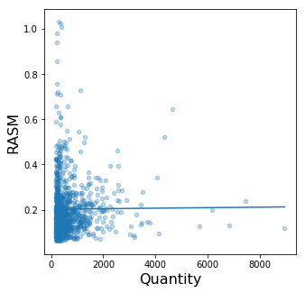

</div>
</div>
</div>


That looks unconvincing. Let's segment the market based on distance into 3 categories. Make a scatter plot when you're done. 

1. short (distance is less than 700)

2. medium (distance is greater than or equal to 700 and less than 1900)

3. long (distance is greater than or equal to 1900)


<div markdown="1" class="cell code_cell">
<div class="input_area" markdown="1">
```python
airlinesFiltered

```
</div>

<div class="output_wrapper" markdown="1">
<div class="output_subarea" markdown="1">


<div markdown="0" class="output output_html">
<table border="1" class="dataframe">
    <thead>
        <tr>
            <th>City 1</th> <th>City 2</th> <th>Price</th> <th>Distance</th> <th>Quantity</th> <th>Market Leading Airline</th> <th>Market Share</th> <th>Average Fare.1</th> <th>Low Price Airline</th> <th>Market Share.1</th>
        </tr>
    </thead>
    <tbody>
        <tr>
            <td>CAK   </td> <td>ATL    </td> <td>114.47</td> <td>528     </td> <td>424.56  </td> <td>FL                    </td> <td>70.19       </td> <td>111.03        </td> <td>FL               </td> <td>70.19         </td>
        </tr>
        <tr>
            <td>CAK   </td> <td>MCO    </td> <td>122.47</td> <td>860     </td> <td>276.84  </td> <td>FL                    </td> <td>75.1        </td> <td>123.09        </td> <td>DL               </td> <td>17.23         </td>
        </tr>
        <tr>
            <td>ALB   </td> <td>ATL    </td> <td>214.42</td> <td>852     </td> <td>215.76  </td> <td>DL                    </td> <td>78.89       </td> <td>223.98        </td> <td>CO               </td> <td>2.77          </td>
        </tr>
        <tr>
            <td>ALB   </td> <td>BWI    </td> <td>69.4  </td> <td>288     </td> <td>606.84  </td> <td>WN                    </td> <td>96.97       </td> <td>68.86         </td> <td>WN               </td> <td>96.97         </td>
        </tr>
        <tr>
            <td>ALB   </td> <td>ORD    </td> <td>158.13</td> <td>723     </td> <td>313.04  </td> <td>UA                    </td> <td>39.79       </td> <td>161.36        </td> <td>WN               </td> <td>15.34         </td>
        </tr>
        <tr>
            <td>ALB   </td> <td>FLL    </td> <td>135.17</td> <td>1204    </td> <td>199.02  </td> <td>WN                    </td> <td>40.68       </td> <td>137.97        </td> <td>DL               </td> <td>17.09         </td>
        </tr>
        <tr>
            <td>ALB   </td> <td>LAS    </td> <td>152.85</td> <td>2237    </td> <td>237.17  </td> <td>WN                    </td> <td>59.94       </td> <td>148.59        </td> <td>WN               </td> <td>59.94         </td>
        </tr>
        <tr>
            <td>ALB   </td> <td>LAX    </td> <td>190.73</td> <td>2467    </td> <td>191.95  </td> <td>DL                    </td> <td>17.89       </td> <td>205.06        </td> <td>US               </td> <td>16.59         </td>
        </tr>
        <tr>
            <td>ALB   </td> <td>MCO    </td> <td>129.35</td> <td>1073    </td> <td>550.54  </td> <td>WN                    </td> <td>76.84       </td> <td>127.69        </td> <td>WN               </td> <td>76.84         </td>
        </tr>
        <tr>
            <td>ALB   </td> <td>TPA    </td> <td>134.17</td> <td>1130    </td> <td>202.93  </td> <td>US                    </td> <td>35.4        </td> <td>132.91        </td> <td>DL               </td> <td>26.4          </td>
        </tr>
    </tbody>
</table>
<p>... (990 rows omitted)</p>
</div>


</div>
</div>
</div>


<div markdown="1" class="cell code_cell">
<div class="input_area" markdown="1">
```python
short = airlinesFiltered.where(airlinesFiltered.column("Distance") < 700)
medium = airlinesFiltered.where(airlinesFiltered.column("Distance") >= 700 & (airlinesFiltered.column("Distance") < 1900))
long = airlinesFiltered.where(airlinesFiltered.column("Distance") >= 1900)

```
</div>

</div>


<div markdown="1" class="cell code_cell">
<div class="input_area" markdown="1">
```python
short.scatter("Quantity" , "Price", fit_line = True, alpha = 0.4, color = "tab:blue")

```
</div>

<div class="output_wrapper" markdown="1">
<div class="output_subarea" markdown="1">

{:.output_png}
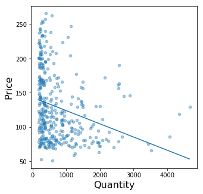

</div>
</div>
</div>


<div markdown="1" class="cell code_cell">
<div class="input_area" markdown="1">
```python
medium.scatter("Quantity" , "Price", fit_line = True, alpha = 0.4, color = "tab:blue")

```
</div>

<div class="output_wrapper" markdown="1">
<div class="output_subarea" markdown="1">

{:.output_png}
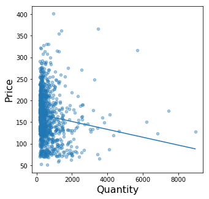

</div>
</div>
</div>


<div markdown="1" class="cell code_cell">
<div class="input_area" markdown="1">
```python
long.scatter("Quantity" , "Price", fit_line = True, alpha = 0.4, color = "tab:blue")

```
</div>

<div class="output_wrapper" markdown="1">
<div class="output_subarea" markdown="1">

{:.output_png}
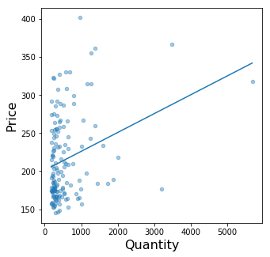

</div>
</div>
</div>


Most of the data seems to be scattered between 0 and 2000. Let's only look at that data for each of the market segments.


<div markdown="1" class="cell code_cell">
<div class="input_area" markdown="1">
```python
short = short.where(short.column("Quantity") < 2000)
medium = medium.where(medium.column("Quantity") < 2000)
long = long.where(long.column("Quantity") < 2000)

```
</div>

</div>


<div markdown="1" class="cell code_cell">
<div class="input_area" markdown="1">
```python
short.scatter("Quantity" , "Price", fit_line = True, alpha = 0.4, color = "tab:blue")

```
</div>

<div class="output_wrapper" markdown="1">
<div class="output_subarea" markdown="1">

{:.output_png}
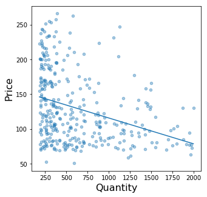

</div>
</div>
</div>


<div markdown="1" class="cell code_cell">
<div class="input_area" markdown="1">
```python
medium.scatter("Quantity" , "Price", fit_line = True, alpha = 0.4, color = "tab:blue")

```
</div>

<div class="output_wrapper" markdown="1">
<div class="output_subarea" markdown="1">

{:.output_png}
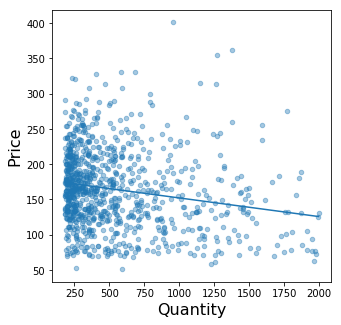

</div>
</div>
</div>


<div markdown="1" class="cell code_cell">
<div class="input_area" markdown="1">
```python
long.scatter("Quantity" , "Price", fit_line = True, alpha = 0.4, color = "tab:blue")

```
</div>

<div class="output_wrapper" markdown="1">
<div class="output_subarea" markdown="1">

{:.output_png}
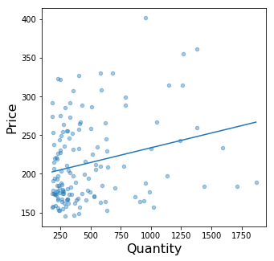

</div>
</div>
</div>


We can observe that "long" is different from "short" and "medium". This is due to a number of reasons (different supply curve, popularity of flights, etc). We will only focus on "short" and "medium" going forward.


Let's find the mean of the price of tickets sold per market segment.


<div markdown="1" class="cell code_cell">
<div class="input_area" markdown="1">
```python
np.mean(short.column("Price"))

```
</div>

<div class="output_wrapper" markdown="1">
<div class="output_subarea" markdown="1">


{:.output_data_text}
```
129.70494152046786
```


</div>
</div>
</div>


<div markdown="1" class="cell code_cell">
<div class="input_area" markdown="1">
```python
np.mean(medium.column("Price"))

```
</div>

<div class="output_wrapper" markdown="1">
<div class="output_subarea" markdown="1">


{:.output_data_text}
```
164.0686778593914
```


</div>
</div>
</div>


Let's also find the mean of the quantity of tickets sold per market segment.


<div markdown="1" class="cell code_cell">
<div class="input_area" markdown="1">
```python
np.mean(short.column("Quantity"))

```
</div>

<div class="output_wrapper" markdown="1">
<div class="output_subarea" markdown="1">


{:.output_data_text}
```
622.004298245614
```


</div>
</div>
</div>


<div markdown="1" class="cell code_cell">
<div class="input_area" markdown="1">
```python
np.mean(medium.column("Quantity"))

```
</div>

<div class="output_wrapper" markdown="1">
<div class="output_subarea" markdown="1">


{:.output_data_text}
```
544.6893913955929
```


</div>
</div>
</div>


Now you should see a linear relationship between price and quantity. Find and interpret an equation for each market segment. 

The general template is $y = mx + b$, where $m$ is the slope and $b$ is $y$-intercept. In economic terms, $m$ is the demand curve's slope that shows how the good's price affects the quantity demanded, and $b$ encompasses the effects of all of the factors that are not price that affect demand. 

We will use `np.polyfit` to find the slope and $y$-intercept. The first value in the array will be the slope, and the second value in the array will be the $y$-intercept.


<div markdown="1" class="cell code_cell">
<div class="input_area" markdown="1">
```python
shortCoefficients = np.polyfit(short.column("Quantity"),short.column("Price"),1)
shortCoefficients

```
</div>

<div class="output_wrapper" markdown="1">
<div class="output_subarea" markdown="1">


{:.output_data_text}
```
array([-3.71445384e-02,  1.52809004e+02])
```


</div>
</div>
</div>


<div markdown="1" class="cell code_cell">
<div class="input_area" markdown="1">
```python
mediumCoefficients = np.polyfit(medium.column("Quantity"), medium.column("Price"),1)
mediumCoefficients

```
</div>

<div class="output_wrapper" markdown="1">
<div class="output_subarea" markdown="1">


{:.output_data_text}
```
array([-2.64947489e-02,  1.78500087e+02])
```


</div>
</div>
</div>


<div markdown="1" class="cell code_cell">
<div class="input_area" markdown="1">
```python
Q = sympy.Symbol("Q")
shortdemand = -.037 * Q + 152.8
shortdemand

```
</div>

<div class="output_wrapper" markdown="1">
<div class="output_subarea" markdown="1">


{:.output_data_text}
```
-0.037*Q + 152.8
```


</div>
</div>
</div>


<div markdown="1" class="cell code_cell">
<div class="input_area" markdown="1">
```python
mediumdemand = -.026 * Q + 178.5
mediumdemand

```
</div>

<div class="output_wrapper" markdown="1">
<div class="output_subarea" markdown="1">


{:.output_data_text}
```
-0.026*Q + 178.5
```


</div>
</div>
</div>


Let's assume the supply curve for airfare is $y = 0.0225x + 100$ for each. This is not based on any data; it is chosen out for the purpose of this exercise. Use SymPy to create an expression for supply and interpret what this means.


<div markdown="1" class="cell code_cell">
<div class="input_area" markdown="1">
```python
supply = 0.0225 * Q + 100

```
</div>

</div>


Find the quantity equilibrium using the supply and demand curves for each market. Describe Q*. 


<div markdown="1" class="cell code_cell">
<div class="input_area" markdown="1">
```python
Q_star_short = solve(shortdemand, supply)
Q_star_short

```
</div>

<div class="output_wrapper" markdown="1">
<div class="output_subarea" markdown="1">


{:.output_data_text}
```
887.394957983193
```


</div>
</div>
</div>


<div markdown="1" class="cell code_cell">
<div class="input_area" markdown="1">
```python
Q_star_medium = solve(mediumdemand, supply)
Q_star_medium

```
</div>

<div class="output_wrapper" markdown="1">
<div class="output_subarea" markdown="1">


{:.output_data_text}
```
1618.55670103093
```


</div>
</div>
</div>


Why are the quantity equilibriums different from the mean of quantity of tickets sold different? Specifically, why is the quantity equilibrium so different from the average quantity for the medium market segment. 


Find the price equilibrium using the supply and demand curves for each market. Describe P*.


<div markdown="1" class="cell code_cell">
<div class="input_area" markdown="1">
```python
shortdemand.subs(Q, Q_star_short)
supply.subs(Q, Q_star_short)

```
</div>

<div class="output_wrapper" markdown="1">
<div class="output_subarea" markdown="1">


{:.output_data_text}
```
119.966386554622
```


</div>
</div>
</div>


<div markdown="1" class="cell code_cell">
<div class="input_area" markdown="1">
```python
mediumdemand.subs(Q, Q_star_medium)
supply.subs(Q, Q_star_medium)

```
</div>

<div class="output_wrapper" markdown="1">
<div class="output_subarea" markdown="1">


{:.output_data_text}
```
136.417525773196
```


</div>
</div>
</div>


Why are the price equilibriums different from the mean of quantity of tickets sold different? 


Visualize the market equilibrium on a graph. Describe the market equilibrium in this case.


<div markdown="1" class="cell code_cell">


<div class="output_wrapper" markdown="1">
<div class="output_subarea" markdown="1">

{:.output_png}
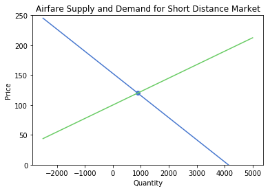

</div>
</div>
</div>


<div markdown="1" class="cell code_cell">


<div class="output_wrapper" markdown="1">
<div class="output_subarea" markdown="1">

{:.output_png}
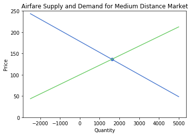

</div>
</div>
</div>


How do the two market segments compare against each other?


<div markdown="1" class="cell code_cell">


<div class="output_wrapper" markdown="1">
<div class="output_subarea" markdown="1">

{:.output_png}
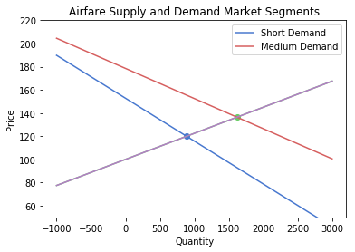

</div>
</div>
</div>


Assume the economy boosted 4% last quarter and all consumers in the short distance airfare industry now have $40 more to spend on airfare. How will this impact the demand curve? Describe how this will change market equilibrium both algebraically and graphically.


<div markdown="1" class="cell code_cell">


<div class="output_wrapper" markdown="1">
<div class="output_subarea" markdown="1">

{:.output_png}
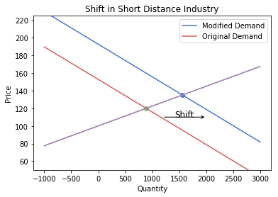

</div>
</div>
</div>


### Delta's Innovations


In 2002, Delta sponsored the 2002 Olympic Winter Games at its Salt Lake City hub. Different technological innovations, such as kiosks at check-in, expanded gate information systems and virtual check-in on websites improved customer experience. Because of these two factors, consumers believed Delta was a promising airline to fly on. Manipulate the original table to only assume Delta flights for Market Leading Airline and see if its demand curve is different from the general demand curve. Why do you think there is a difference or is not a difference?


<div markdown="1" class="cell code_cell">
<div class="input_area" markdown="1">
```python
airlines

```
</div>

<div class="output_wrapper" markdown="1">
<div class="output_subarea" markdown="1">


<div markdown="0" class="output output_html">
<table border="1" class="dataframe">
    <thead>
        <tr>
            <th>City 1</th> <th>City 2</th> <th>Average Fare</th> <th>Distance</th> <th>Average Weekly Passengers</th> <th>Market Leading Airline</th> <th>Market Share</th> <th>Average Fare.1</th> <th>Low Price Airline</th> <th>Market Share.1</th>
        </tr>
    </thead>
    <tbody>
        <tr>
            <td>CAK   </td> <td>ATL    </td> <td>114.47      </td> <td>528     </td> <td>424.56                   </td> <td>FL                    </td> <td>70.19       </td> <td>111.03        </td> <td>FL               </td> <td>70.19         </td>
        </tr>
        <tr>
            <td>CAK   </td> <td>MCO    </td> <td>122.47      </td> <td>860     </td> <td>276.84                   </td> <td>FL                    </td> <td>75.1        </td> <td>123.09        </td> <td>DL               </td> <td>17.23         </td>
        </tr>
        <tr>
            <td>ALB   </td> <td>ATL    </td> <td>214.42      </td> <td>852     </td> <td>215.76                   </td> <td>DL                    </td> <td>78.89       </td> <td>223.98        </td> <td>CO               </td> <td>2.77          </td>
        </tr>
        <tr>
            <td>ALB   </td> <td>BWI    </td> <td>69.4        </td> <td>288     </td> <td>606.84                   </td> <td>WN                    </td> <td>96.97       </td> <td>68.86         </td> <td>WN               </td> <td>96.97         </td>
        </tr>
        <tr>
            <td>ALB   </td> <td>ORD    </td> <td>158.13      </td> <td>723     </td> <td>313.04                   </td> <td>UA                    </td> <td>39.79       </td> <td>161.36        </td> <td>WN               </td> <td>15.34         </td>
        </tr>
        <tr>
            <td>ALB   </td> <td>FLL    </td> <td>135.17      </td> <td>1204    </td> <td>199.02                   </td> <td>WN                    </td> <td>40.68       </td> <td>137.97        </td> <td>DL               </td> <td>17.09         </td>
        </tr>
        <tr>
            <td>ALB   </td> <td>LAS    </td> <td>152.85      </td> <td>2237    </td> <td>237.17                   </td> <td>WN                    </td> <td>59.94       </td> <td>148.59        </td> <td>WN               </td> <td>59.94         </td>
        </tr>
        <tr>
            <td>ALB   </td> <td>LAX    </td> <td>190.73      </td> <td>2467    </td> <td>191.95                   </td> <td>DL                    </td> <td>17.89       </td> <td>205.06        </td> <td>US               </td> <td>16.59         </td>
        </tr>
        <tr>
            <td>ALB   </td> <td>MCO    </td> <td>129.35      </td> <td>1073    </td> <td>550.54                   </td> <td>WN                    </td> <td>76.84       </td> <td>127.69        </td> <td>WN               </td> <td>76.84         </td>
        </tr>
        <tr>
            <td>ALB   </td> <td>TPA    </td> <td>134.17      </td> <td>1130    </td> <td>202.93                   </td> <td>US                    </td> <td>35.4        </td> <td>132.91        </td> <td>DL               </td> <td>26.4          </td>
        </tr>
    </tbody>
</table>
<p>... (990 rows omitted)</p>
</div>


</div>
</div>
</div>


The following cell of code is provided.


<div markdown="1" class="cell code_cell">
<div class="input_area" markdown="1">
```python
delta = airlines.where("Market Leading Airline", "DL")
delta = delta.select(["Average Fare", "Average Weekly Passengers"])
delta = delta.relabeled(["Average Weekly Passengers", "Average Fare"], ["Quantity", "Price"])
delta = delta.where(delta.column("Quantity") < 2000)

```
</div>

</div>


<div markdown="1" class="cell code_cell">
<div class="input_area" markdown="1">
```python
delta.scatter("Quantity", "Price", fit_line = True, color = "tab:blue")

```
</div>

<div class="output_wrapper" markdown="1">
<div class="output_subarea" markdown="1">

{:.output_png}
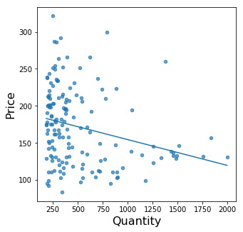

</div>
</div>
</div>


<div markdown="1" class="cell code_cell">
<div class="input_area" markdown="1">
```python
np.polyfit(delta.column("Quantity"),delta.column("Price"),1)

```
</div>

<div class="output_wrapper" markdown="1">
<div class="output_subarea" markdown="1">


{:.output_data_text}
```
array([-3.49594506e-02,  1.89076806e+02])
```


</div>
</div>
</div>


<div markdown="1" class="cell code_cell">
<div class="input_area" markdown="1">
```python
deltademand = -0.035 * Q + 189.1

```
</div>

</div>


Suppose the supply curve is $\text{Supply} = 0.03 \cdot Q + 14$. This is not based on any data; it is chosen out for the purpose of this exercise. Write its expression. 


<div markdown="1" class="cell code_cell">
<div class="input_area" markdown="1">
```python
deltasupply = 0.03 * Q + 14

```
</div>

</div>


Find the quantity equilibrium.


<div markdown="1" class="cell code_cell">
<div class="input_area" markdown="1">
```python
Q_star_delta = solve(deltademand, deltasupply)
Q_star_delta

```
</div>

<div class="output_wrapper" markdown="1">
<div class="output_subarea" markdown="1">


{:.output_data_text}
```
2693.84615384615
```


</div>
</div>
</div>


Find the price equilibrium.


<div markdown="1" class="cell code_cell">
<div class="input_area" markdown="1">
```python
deltademand.subs(Q, Q_star_delta)

```
</div>

<div class="output_wrapper" markdown="1">
<div class="output_subarea" markdown="1">


{:.output_data_text}
```
94.8153846153846
```


</div>
</div>
</div>


<div markdown="1" class="cell code_cell">
<div class="input_area" markdown="1">
```python
deltasupply.subs(Q, Q_star_delta)

```
</div>

<div class="output_wrapper" markdown="1">
<div class="output_subarea" markdown="1">


{:.output_data_text}
```
94.8153846153846
```


</div>
</div>
</div>


Find the market equilibrium. Visualize it.


<div markdown="1" class="cell code_cell">


<div class="output_wrapper" markdown="1">
<div class="output_subarea" markdown="1">

{:.output_png}
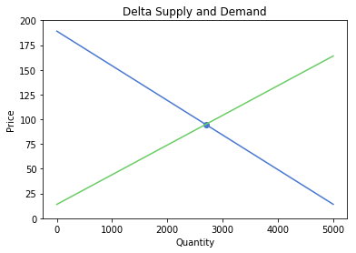

</div>
</div>
</div>


In this week's homework, one of the exercises you will work on is to compare Delta vs non-Delta flights' demand. Until then, let's suppose that Delta's innovations did influence the demand of Delta tickets. How would the demand curve shift? 


<div id="lab03-wgt01">
    <iframe src="https://econ-models-widget.herokuapp.com/?id=lab03-wgt01" id="lab03-wgt01-iframe" class="widget-iframe"></iframe>
</div>

 

